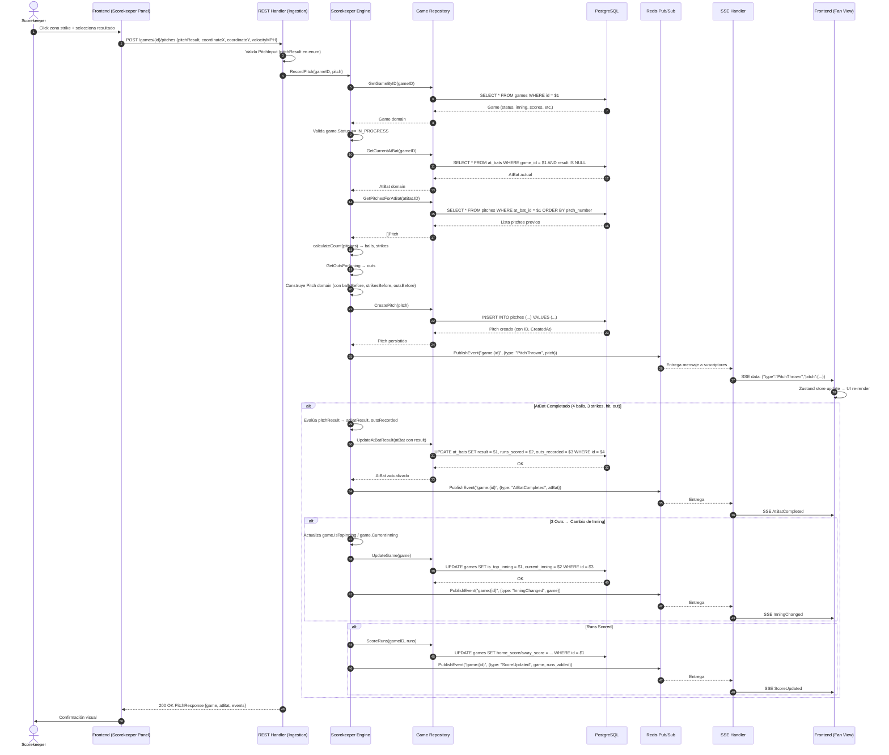
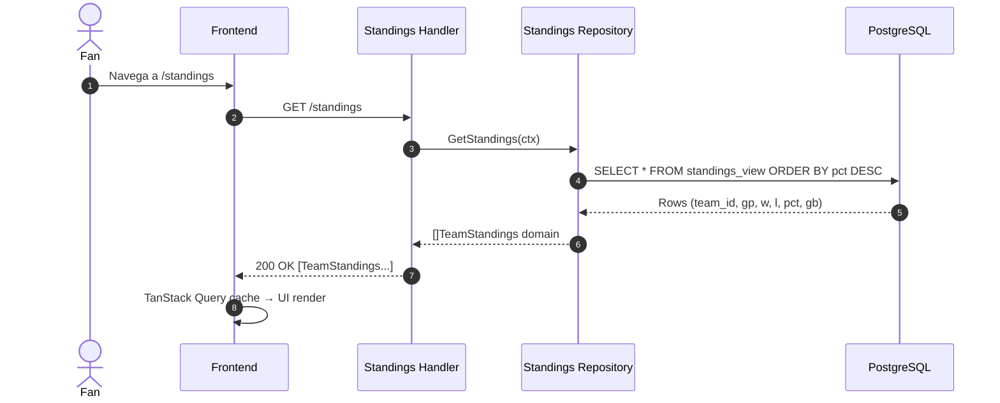
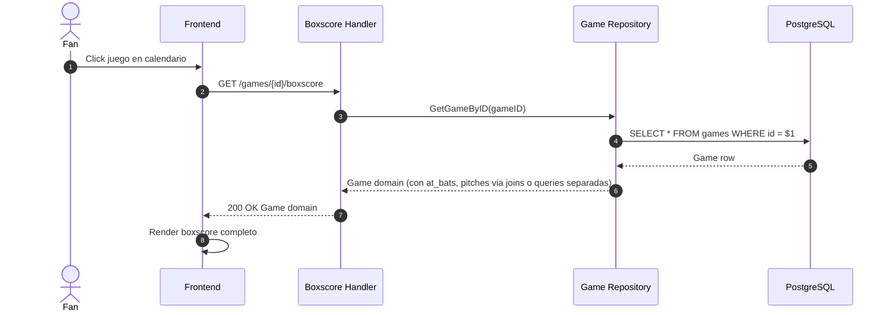
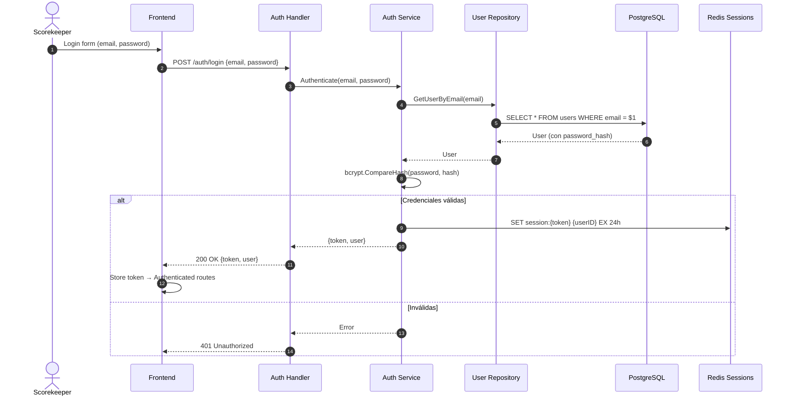
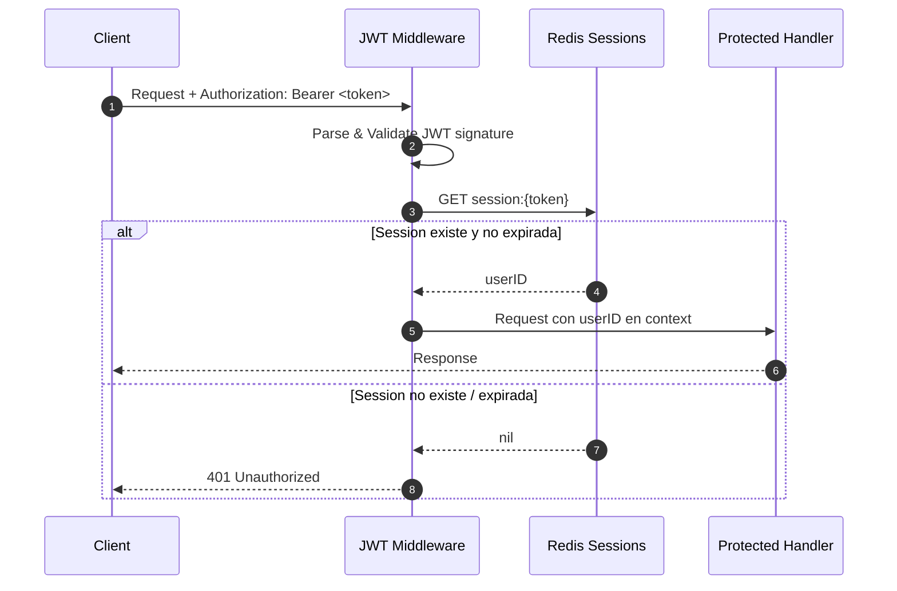
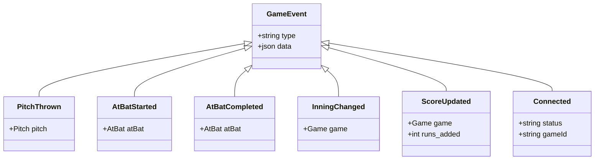

# Flujo de Datos - LVBP GameCast

## Flujo Principal: Ingesta de Pitch → Fan Update



## Flujo: Consulta Standings (REST)



## Flujo: Consulta Boxscore (REST)



## Flujo: Autenticación Scorekeeper



## Flujo: Middleware JWT en Requests Protegidos



## Modelo de Eventos SSE (Game Channel)



## Canales Redis

| Canal | Patrón | Productores | Consumidores |
|-------|--------|-------------|--------------|
| `game:{gameId}:events` | Pub/Sub | Scorekeeper Engine | SSE StreamHandler |
| `session:{token}` | Key-Value (TTL) | Auth Service | JWT Middleware |

## Esquema de Base de Datos (Relacional)

```mermaid
erDiagram
    USERS ||--o{ GAMES : ""
    TEAMS ||--o{ GAMES : "home_team"
    TEAMS ||--o{ GAMES : "away_team"
    GAMES ||--o{ AT_BATS : "has"
    AT_BATS ||--o{ PITCHES : "contains"
    
    USERS {
        uuid id PK
        varchar email UK
        varchar password_hash
        timestamptz created_at
    }
    
    TEAMS {
        varchar(10) id PK
        varchar name
        varchar short_name
        text logo_url
        timestamptz created_at
    }
    
    GAMES {
        uuid id PK
        varchar(10) home_team_id FK
        varchar(10) away_team_id FK
        game_status status
        int home_score
        int away_score
        int current_inning
        boolean is_top_inning
        timestamptz start_time
        timestamptz created_at
    }
    
    AT_BATS {
        uuid id PK
        uuid game_id FK
        int inning
        boolean is_top_inning
        varchar batter_id
        varchar pitcher_id
        varchar result
        int runs_scored
        int outs_recorded
        timestamptz created_at
    }
    
    PITCHES {
        uuid id PK
        uuid at_bat_id FK
        int pitch_number
        numeric(4,2) coordinate_x
        numeric(4,2) coordinate_y
        varchar pitch_result
        int balls_before
        int strikes_before
        int outs_before
        numeric(4,1) velocity_mph
        timestamptz created_at
    }
```