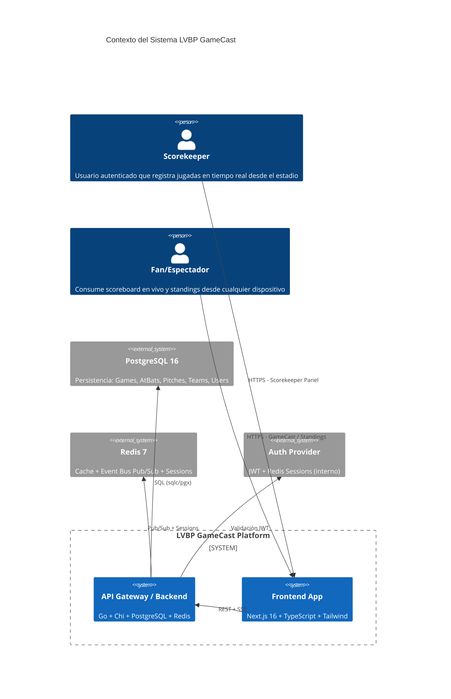
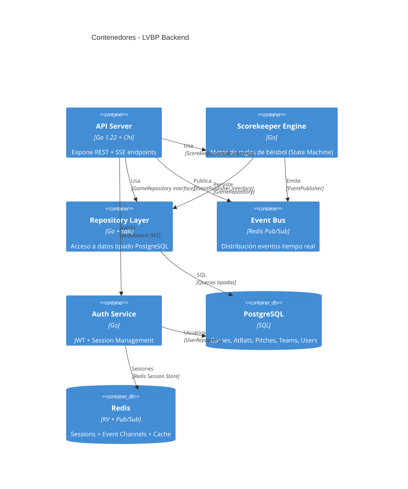

# Visión General de la Arquitectura

## Diagrama de Contexto (C4 Level 1)



## Diagrama de Contenedores (C4 Level 2)



## Canales de Comunicación

| Canal | Protocolo | Patrón | Uso |
|-------|-----------|--------|-----|
| **Histórico** | REST/HTTPS | Request-Response | Standings, Boxscore, Auth |
| **Tiempo Real** | SSE (Server-Sent Events) | Pub/Sub Unidireccional | Pitches, AtBats, Score, Inning Changes |
| **Interno** | Redis Pub/Sub | Fan-out | Engine → SSE Handlers |

## Principios de Diseño Aplicados

### SOLID en Backend
- **S** - Cada handler tiene responsabilidad única (Ingestion, Standings, Boxscore, SSE)
- **O** - Interfaces `ports.GameRepository`, `ports.ScorekeeperService`, `ports.EventBus` abiertas a extensión
- **L** - Implementaciones intercambiables (PostgresRepo, MockRepo para tests)
- **I** - Interfaces segregadas por capacidad (GameRepository vs StandingsRepository)
- **D** - Inyección de dependencias via constructor (`NewBoxscoreHandler(repo)`)

### KISS / YAGNI
- No ORM, solo `sqlc` para queries tipadas
- Sin framework SSE externo, `http.Flusher` nativo
- Motor de reglas sigue input explícito del scorekeeper (no infiere de coordenadas)

### Hexagonal Traits (Modular Monolith)
```
internal/
├── auth/           # Módulo autenticación
├── core/           # Dominio puro (domain, ports, services)
├── handlers/       # Adaptadores entrada (REST, SSE)
├── infrastructure/ # Adaptadores salida (Postgres, Redis)
└── pkg/            # Shared (Redis client)
```

## Decisiones Arquitectónicas Clave (ADRs)

| ADR | Título | Estado |
|-----|--------|--------|
| [001](./adr/001-hybrid-rest-sse.md) | Arquitectura Híbrida REST + SSE | Aceptado |
| [002](./adr/002-sqlc-over-orm.md) | sqlc en lugar de ORM | Aceptado |
| [003](./adr/003-scorekeeper-explicit-input.md) | Scorekeeper sigue input explícito | Aceptado |
| [004](./adr/004-redis-pubsub-eventbus.md) | Redis Pub/Sub como Event Bus | Aceptado |
| [005](./adr/005-zustand-tanstack-segregation.md) | Separación Zustand (live) / TanStack (REST) | Aceptado |

## NFRs Cumplidos

| NFR | Objetivo | Implementación |
|-----|----------|----------------|
| **NFR-1 Latencia** | < 200ms ingestion→client | SSE nativo, Redis Pub/Sub, sin buffering proxy |
| **NFR-2 Concurrencia** | 5,000 clientes / < 250MB | Go goroutines, connection pooling, streaming |
| **NFR-3 Proxy Buffering** | Deshabilitado | Headers `X-Accel-Buffering: no`, `Cache-Control: no-cache` |