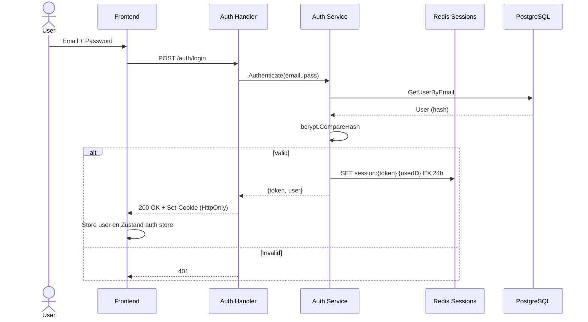

# Fase 1: Sistema de Autenticación

## Resumen

Implementación completa de autenticación basada en JWT con sesiones en Redis para scorekeepers.

## Componentes

### Backend

| Archivo | Responsabilidad |
|---------|-----------------|
| `internal/auth/core/user.go` | Entidad User + validaciones |
| `internal/auth/core/service.go` | Lógica auth (login, register, validate) |
| `internal/auth/core/service_test.go` | Tests unitarios |
| `internal/auth/infrastructure/postgres/user_repository.go` | UserRepository (sqlc) |
| `internal/auth/infrastructure/postgres/postgres.go` | Config DB auth |
| `internal/auth/infrastructure/redis/session_repository.go` | SessionRepository (Redis) |
| `internal/auth/infrastructure/redis/redis.go` | Cliente Redis auth |
| `internal/auth/handlers/handler.go` | HTTP Handlers (login, logout, me) |
| `internal/auth/builder.go` | Dependency injection wiring |

### Frontend

| Archivo | Responsabilidad |
|---------|-----------------|
| `src/features/auth/hooks/useAuth.ts` | Zustand store + TanStack Query para auth |
| `src/features/auth/components/LoginForm.tsx` | Formulario login con validación |
| `src/app/(auth)/login/page.tsx` | Página login (Server Component) |

## Flujo de Autenticación



## DTOs

### Request: `POST /auth/login`
```json
{
  "email": "scorekeeper@lvbp.com",
  "password": "securePassword123"
}
```

### Response: `200 OK`
```json
{
  "token": "eyJhbGciOiJIUzI1NiIs...",
  "user": {
    "id": "uuid",
    "email": "scorekeeper@lvbp.com",
    "createdAt": "2026-09-01T10:00:00Z"
  }
}
```

### Response: `401 Unauthorized`
```json
{
  "error": "Invalid credentials"
}
```

## Endpoints

| Método | Ruta | Descripción | Auth |
|--------|------|-------------|------|
| POST | `/auth/login` | Login scorekeeper | No |
| POST | `/auth/logout` | Logout (revoca sesión) | Sí |
| GET | `/auth/me` | Usuario actual | Sí |

## Middleware JWT

```go
// internal/auth/middleware.go (conceptual)
func JWTMiddleware(next http.Handler) http.Handler {
  return http.HandlerFunc(func(w http.ResponseWriter, r *http.Request) {
    token := extractToken(r) // Header o Cookie
    session, err := sessionRepo.Get(r.Context(), token)
    if err != nil || session == nil {
      http.Error(w, "Unauthorized", 401)
      return
    }
    ctx := context.WithValue(r.Context(), UserIDKey, session.UserID)
    next.ServeHTTP(w, r.WithContext(ctx))
  })
}
```

## Seguridad

- **Passwords**: bcrypt cost 12
- **JWT**: HS256, expiración 24h, claims: `sub` (userID), `exp`, `iat`
- **Sessions**: Redis TTL 24h, key `session:{token}`
- **Cookies**: HttpOnly, Secure, SameSite=Lax
- **Rate limiting**: 5 req/min en `/auth/login` (TODO: implementar)

## Tests

```bash
# Backend
cd backend && go test ./internal/auth/... -v

# Frontend
cd web && pnpm test --filter=@lvbp/auth
```

## Decisiones Clave

| Decisión | Justificación |
|----------|---------------|
| JWT + Redis Sessions | Revocación inmediata en logout, escalabilidad horizontal |
| bcrypt cost 12 | Balance seguridad/performance (≈100ms) |
| HttpOnly Cookies | Previene XSS token theft |
| Sin refresh tokens | Simplicidad: sesión 24h, re-login si expira (YAGNI) |

## Próximos Pasos

- [ ] Rate limiting en login
- [ ] Audit log de logins fallidos
- [ ] 2FA opcional para admins
- [ ] Password reset flow