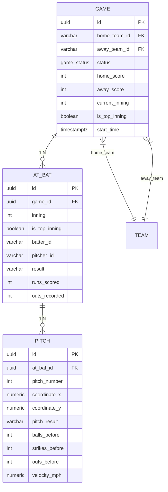

# Fase 2: Modelos de Dominio

## Resumen

Definición de las entidades de dominio puras (sin dependencias de infraestructura) que representan el modelo de béisbol.

## Entidades de Dominio

### Game (`core/domain/game.go`)

```go
type GameStatus string

const (
    GameStatusScheduled  GameStatus = "SCHEDULED"
    GameStatusInProgress GameStatus = "IN_PROGRESS"
    GameStatusFinal      GameStatus = "FINAL"
    GameStatusPostponed  GameStatus = "POSTPONED"
    GameStatusSuspended  GameStatus = "SUSPENDED"
)

type Game struct {
    ID            uuid.UUID
    HomeTeamID    string
    AwayTeamID    string
    Status        GameStatus
    HomeScore     int
    AwayScore     int
    CurrentInning int
    IsTopInning   bool
    StartTime     time.Time
    CreatedAt     time.Time
}
```

**Reglas de Negocio:**
- `Status` controla transiciones: `SCHEDULED` → `IN_PROGRESS` → `FINAL`
- `IsTopInning = true` → Batea visitante (Away), `false` → Batea local (Home)
- `CurrentInning` inicia en 1, incrementa tras 3 outs en bottom

### AtBat (`core/domain/at_bat.go`)

```go
type AtBat struct {
    ID           uuid.UUID
    GameID       uuid.UUID
    Inning       int
    IsTopInning  bool
    BatterID     string
    PitcherID    string
    Result       *string  // nil = en progreso
    RunsScored   int
    OutsRecorded int
    CreatedAt    time.Time
}
```

**Estados:**
- `Result == nil` → At-bat activo
- `Result != nil` → Completado (valores: "Strikeout", "Base on Balls", "Hit", "Out", "Base on Balls", etc.)

### Pitch (`core/domain/pitch.go`)

```go
type Pitch struct {
    ID            uuid.UUID
    AtBatID       uuid.UUID
    PitchNumber   int
    CoordinateX   float64
    CoordinateY   float64
    PitchResult   string
    BallsBefore   int
    StrikesBefore int
    OutsBefore    int
    VelocityMPH   *float64
    CreatedAt     time.Time
}
```

**Campos de Contexto (Snapshot):**
- `BallsBefore`, `StrikesBefore`, `OutsBefore`: Estado del count ANTES de este pitch
- Permiten reconstruir visualización completa del at-bat

### TeamStandings (`core/domain/standings.go`)

```go
type TeamStandings struct {
    TeamID      int
    GamesPlayed int
    Won         int
    Lost        int
    Pct         float64
    GamesBehind float64
}
```

**Cálculo:**
- `Pct = Won / GamesPlayed` (redondeado .3f)
- `GamesBehind` calculado vs líder división

### Team (Frontend - `web/src/lib/mock-data.ts`)

```typescript
interface Team {
  id: string;           // "ldc", "ndm", etc.
  name: string;         // "Leones del Caracas"
  shortName: string;    // "LEO"
  city: string;
  primaryColor: string; // Hex para theming
  logoInitials: string; // Fallback si no hay logo
  logoUrl?: string;
}
```

## Diagrama de Relaciones



## Mapeo DB ↔ Domain

| Tabla SQL | Struct Go Domain | Diferencias |
|-----------|------------------|-------------|
| `games` | `domain.Game` | `status` enum ↔ `GameStatus` type |
| `at_bats` | `domain.AtBat` | `result` nullable ↔ `*string` |
| `pitches` | `domain.Pitch` | `velocity_mph` nullable ↔ `*float64` |
| `teams` | `domain.Team` (mock) | Frontend usa mock data por ahora |

## Conversión sqlc → Domain

```go
// internal/infrastructure/db/models.go (sqlc generated)
type Game struct {
    ID            uuid.UUID
    HomeTeamID    pgtype.Text
    AwayTeamID    pgtype.Text
    Status        NullGameStatus
    HomeScore     pgtype.Int4
    AwayScore     pgtype.Int4
    CurrentInning pgtype.Int4
    IsTopInning   pgtype.Bool
    StartTime     time.Time
    CreatedAt     pgtype.Timestamptz
}

// Conversión en repository
func (r *GameRepository) toDomainGame(dbGame db.Game) *domain.Game {
    return &domain.Game{
        ID:            dbGame.ID,
        HomeTeamID:    dbGame.HomeTeamID.String,
        AwayTeamID:    dbGame.AwayTeamID.String,
        Status:        domain.GameStatus(dbGame.Status.GameStatus),
        HomeScore:     int(dbGame.HomeScore.Int32),
        AwayScore:     int(dbGame.AwayScore.Int32),
        CurrentInning: int(dbGame.CurrentInning.Int32),
        IsTopInning:   dbGame.IsTopInning.Bool,
        StartTime:     dbGame.StartTime,
        CreatedAt:     dbGame.CreatedAt.Time,
    }
}
```

## Validaciones de Dominio

| Entidad | Validaciones |
|---------|--------------|
| Game | `HomeTeamID != AwayTeamID`, `CurrentInning >= 1`, `StartTime` futuro o presente |
| AtBat | `BatterID != PitcherID`, `Inning >= 1`, `OutsRecorded <= 3` |
| Pitch | `PitchNumber >= 1`, `CoordinateX/Y` en rango strike zone, `PitchResult` en enum válido |

## Tests

```go
// core/domain/game_test.go
func TestGameStatusTransitions(t *testing.T) {
    g := &domain.Game{Status: domain.GameStatusScheduled}
    // No se puede anotar run en SCHEDULED
    assert.Error(t, g.AddRun(true)) // error: game not in progress
}
```

## Próximos Pasos

- [ ] Mover `Team` a backend (tabla `teams` ya existe en schema)
- [ ] Añadir `Player` entity para batter/pitcher lookup
- [ ] Value objects: `Count` (balls/strikes), `Score`, `InningState`