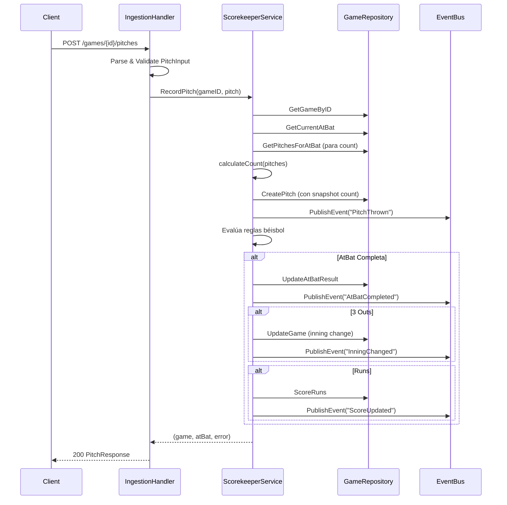

# Fase 3: Handler de Ingesta (Pitch Ingestion)

## Resumen

Endpoint REST para que el scorekeeper envíe pitches en tiempo real. Valida input, delega al Scorekeeper Engine y retorna estado actualizado.

## Endpoint

```
POST /games/{gameId}/pitches
Content-Type: application/json
Authorization: Bearer <token>
```

## DTOs

### Request: `PitchInput` (`handlers/rest/ingestion_handler.go:22`)

```go
type PitchInput struct {
    PitchResult string   `json:"pitchResult" validate:"required,oneof=Ball Called Strike Swinging Strike Foul Ball In Play (Out) In Play (Hit)"`
    CoordinateX *float64 `json:"coordinateX,omitempty"`
    CoordinateY *float64 `json:"coordinateY,omitempty"`
    VelocityMPH *float64 `json:"velocityMPH,omitempty"`
}
```

| Campo | Tipo | Requerido | Descripción |
|-------|------|-----------|-------------|
| `pitchResult` | string | ✅ | Resultado explícito del umpire |
| `coordinateX` | float64 | ❌ | X en zona strike (-1.5 a 1.5) |
| `coordinateY` | float64 | ❌ | Y en zona strike (-1.5 a 1.5) |
| `velocityMPH` | float64 | ❌ | Velocidad del pitch |

### Response: `PitchResponse` (`handlers/rest/ingestion_handler.go:29`)

```go
type PitchResponse struct {
    Game   *domain.Game  `json:"game"`
    AtBat  *domain.AtBat `json:"atBat"`
    Events []string      `json:"events,omitempty"`
}
```

**Eventos posibles en `Events`:**
- `"PitchThrown"` - Siempre presente
- `"AtBatCompleted"` - Si el at-bat terminó
- `"InningChanged"` - Si hubo 3 outs
- `"ScoreUpdated"` - Si se anotaron runs

### Ejemplo Response Exitoso

```json
{
  "game": {
    "id": "uuid",
    "homeTeamId": "ldc",
    "awayTeamId": "ndm",
    "status": "IN_PROGRESS",
    "homeScore": 2,
    "awayScore": 1,
    "currentInning": 3,
    "isTopInning": true,
    "startTime": "2026-09-07T19:00:00-04:00",
    "createdAt": "2026-09-01T10:00:00Z"
  },
  "atBat": {
    "id": "uuid",
    "gameId": "uuid",
    "inning": 3,
    "isTopInning": true,
    "batterId": "player_123",
    "pitcherId": "player_456",
    "result": null,
    "runsScored": 0,
    "outsRecorded": 0,
    "createdAt": "2026-09-07T19:15:00Z"
  },
  "events": ["PitchThrown"]
}
```

### Ejemplo Response At-Bat Completado

```json
{
  "game": { ... },
  "atBat": {
    "result": "Strikeout",
    "outsRecorded": 1,
    ...
  },
  "events": ["PitchThrown", "AtBatCompleted", "InningChanged"]
}
```

## Validaciones

```go
func isValidPitchResult(result string) bool {
    validResults := map[string]bool{
        "Ball":            true,
        "Called Strike":   true,
        "Swinging Strike": true,
        "Foul Ball":       true,
        "In Play (Out)":   true,
        "In Play (Hit)":   true,
    }
    return validResults[result]
}
```

**Errores HTTP:**

| Código | Cuándo |
|--------|--------|
| `400 Bad Request` | JSON inválido, `gameId` no UUID, `pitchResult` no en enum |
| `404 Not Found` | Juego no existe |
| `409 Conflict` | Juego no `IN_PROGRESS`, at-bat actual ya completado |
| `500 Internal` | Error interno BD/Engine |

## Flujo Interno



## Inyección de Dependencias

```go
// internal/handlers/rest/ingestion_handler.go
type IngestionHandler struct {
    scorekeeperService ports.ScorekeeperService
}

func NewIngestionHandler(scorekeeperService ports.ScorekeeperService) *IngestionHandler {
    return &IngestionHandler{scorekeeperService: scorekeeperService}
}
```

## Registro de Rutas

```go
// internal/server/server.go
func (s *Server) registerRoutes() {
    ingestionHandler := rest.NewIngestionHandler(s.scorekeeperService)
    
    s.router.Route("/games", func(r chi.Router) {
        r.Post("/{gameId}/pitches", ingestionHandler.ProcessPitch)
        // ...
    })
}
```

## Tests

```go
// internal/handlers/rest/ingestion_handler_test.go
func TestProcessPitch_ValidInput_ReturnsPitchResponse(t *testing.T) {
    // Setup: game IN_PROGRESS, at-bat activo
    // Act: POST /games/{id}/pitches {"pitchResult": "Ball"}
    // Assert: 200, PitchResponse con events=["PitchThrown"]
}

func TestProcessPitch_GameNotInProgress_Returns409(t *testing.T) {
    // Setup: game FINAL
    // Act: POST pitch
    // Assert: 409 "game is not in progress"
}
```

## Métricas / Observabilidad

- **Latencia objetivo**: < 50ms (handler + engine + DB)
- **Logs**: `slog.Info("pitch_processed", "game_id", id, "pitch_result", result)`
- **Métricas**: `pitches_total{pitch_result="Ball"}` counter

## Próximos Pasos

- [ ] Validación coordenadas en zona strike (warning, no bloqueo)
- [ ] Rate limiting por scorekeeper (max 30 pitches/min)
- [ ] Idempotency key para reintentos de red