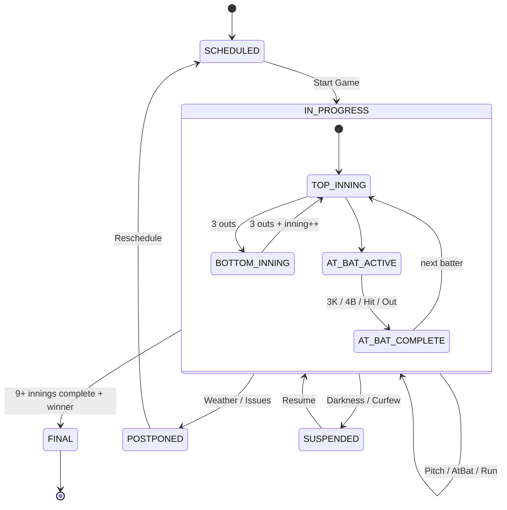

# Fase 4: Motor Scorekeeper (Baseball State Engine)

## Resumen

Motor de reglas de béisbol que procesa pitches y calcula transiciones de estado automáticas: balls/strikes, outs, innings, runs.

## Arquitectura

```go
// internal/core/ports/services.go
type ScorekeeperService interface {
    StartAtBat(ctx context.Context, gameID uuid.UUID, batterID, pitcherID string) (*domain.AtBat, error)
    RecordPitch(ctx context.Context, gameID uuid.UUID, pitch *domain.Pitch) (*domain.Game, *domain.AtBat, error)
    RecordAtBatResult(ctx context.Context, gameID uuid.UUID, result string) (*domain.Game, *domain.AtBat, error)
    ScoreRuns(ctx context.Context, gameID uuid.UUID, runs int) (*domain.Game, error)
}
```

## Implementación (`internal/core/services/scorekeeper.go`)

### RecordPitch - Flujo Principal

```go
func (s *scorekeeperService) RecordPitch(ctx context.Context, gameID uuid.UUID, pitch *domain.Pitch) (*domain.Game, *domain.AtBat, error) {
    // 1. Cargar juego y validar estado
    game, err := s.gameRepo.GetGameByID(ctx, gameID)
    if game.Status != domain.GameStatusInProgress {
        return nil, nil, errors.New("game is not in progress")
    }

    // 2. Obtener at-bat actual
    atBat, err := s.gameRepo.GetCurrentAtBat(ctx, gameID)
    if atBat.Result != nil {
        return nil, nil, errors.New("current at-bat is already completed")
    }

    // 3. Calcular count actual (balls/strikes) desde pitches previos
    pitches, _ := s.gameRepo.GetPitchesForAtBat(ctx, atBat.ID)
    balls, strikes := calculateCount(pitches)
    outs, _ := s.gameRepo.GetOutsForInning(ctx, game.ID, game.CurrentInning, game.IsTopInning)

    // 4. Enriquecer pitch con snapshot del count
    pitch.AtBatID = atBat.ID
    pitch.BallsBefore = balls
    pitch.StrikesBefore = strikes
    pitch.OutsBefore = outs
    pitch.PitchNumber = len(pitches) + 1

    // 5. Persistir pitch
    pitch, _ = s.gameRepo.CreatePitch(ctx, pitch)
    s.eventBus.PublishEvent("game:"+gameID.String(), map[string]any{"type": "PitchThrown", "pitch": pitch})

    // 6. APLICAR REGLAS DE BÉISBOL
    newBalls, newStrikes := balls, strikes
    atBatResult := ""
    outsRecorded := 0
    isCompleted := false

    switch pitch.PitchResult {
    case "Ball":
        newBalls++
        if newBalls == 4 {
            atBatResult = "Base on Balls"
            isCompleted = true
        }
    case "Called Strike", "Swinging Strike":
        newStrikes++
        if newStrikes == 3 {
            atBatResult = "Strikeout"
            outsRecorded = 1
            isCompleted = true
        }
    case "Foul Ball":
        if newStrikes < 2 { newStrikes++ }
    case "In Play (Out)":
        atBatResult = "Out"
        outsRecorded = 1
        isCompleted = true
    case "In Play (Hit)":
        atBatResult = "Hit"
        isCompleted = true
    }

    // 7. Si at-bat completado, persistir y emitir eventos
    if isCompleted {
        atBat.Result = &atBatResult
        atBat.OutsRecorded = outsRecorded
        atBat, _ = s.gameRepo.UpdateAtBatResult(ctx, atBat)
        s.eventBus.PublishEvent("game:"+gameID.String(), map[string]any{"type": "AtBatCompleted", "atBat": atBat})

        // 8. Manejar outs → inning change
        outs += outsRecorded
        if outs >= 3 {
            if game.IsTopInning {
                game.IsTopInning = false
            } else {
                game.IsTopInning = true
                game.CurrentInning++
            }
            game, _ = s.gameRepo.UpdateGame(ctx, game)
            s.eventBus.PublishEvent("game:"+gameID.String(), map[string]any{"type": "InningChanged", "game": game})
        }
    }

    return game, atBat, nil
}
```

### calculateCount - Algoritmo de Conteo

```go
func calculateCount(pitches []*domain.Pitch) (balls int, strikes int) {
    for _, p := range pitches {
        switch p.PitchResult {
        case "Ball":
            balls++
        case "Called Strike", "Swinging Strike":
            strikes++
        case "Foul Ball":
            if strikes < 2 { strikes++ }
        }
    }
    return balls, strikes
}
```

**Nota**: No usa `BallsBefore/StrikesBefore` del pitch (snapshot), recalcula desde historial para consistencia.

### ScoreRuns - Anotación de Carreras

```go
func (s *scorekeeperService) ScoreRuns(ctx context.Context, gameID uuid.UUID, runs int) (*domain.Game, error) {
    game, _ := s.gameRepo.GetGameByID(ctx, gameID)
    
    // Quién batea determina a quién sumar runs
    if game.IsTopInning {
        game.AwayScore += runs  // Top = Visitante batea
    } else {
        game.HomeScore += runs  // Bottom = Local batea
    }
    
    game, _ = s.gameRepo.UpdateGame(ctx, game)
    
    // Actualizar runs en at-bat actual (RBI tracking)
    atBat, _ := s.gameRepo.GetCurrentAtBat(ctx, gameID)
    if atBat != nil && atBat.Result == nil {
        atBat.RunsScored += runs
        s.gameRepo.UpdateAtBatResult(ctx, atBat)
    }
    
    s.eventBus.PublishEvent("game:"+gameID.String(), map[string]any{
        "type": "ScoreUpdated", "game": game, "runs_added": runs,
    })
    return game, nil
}
```

## Máquina de Estados (State Machine)



## Reglas de Béisbol Implementadas

| Situación | Regla | Código |
|-----------|-------|--------|
| 4 Balls | Base on Balls (Walk) | `newBalls == 4` |
| 3 Strikes | Strikeout (1 out) | `newStrikes == 3` |
| Foul Ball | Strike si < 2 strikes | `strikes < 2` |
| In Play Out | 1 out | `outsRecorded = 1` |
| In Play Hit | At-bat complete, 0 outs | `isCompleted = true` |
| 3 Outs | Cambio inning | `outs >= 3` |
| Top → Bottom | Mismo inning | `IsTopInning = false` |
| Bottom → Top | Inning + 1 | `IsTopInning = true, CurrentInning++` |

## Eventos Publicados

| Evento | Cuándo | Payload |
|--------|--------|---------|
| `PitchThrown` | Cada pitch | `{type, pitch}` |
| `AtBatStarted` | `StartAtBat` | `{type, atBat}` |
| `AtBatCompleted` | At-bat termina | `{type, atBat}` |
| `InningChanged` | 3 outs | `{type, game}` |
| `ScoreUpdated` | Runs anotados | `{type, game, runs_added}` |

## Tests

```go
// internal/core/services/scorekeeper_test.go
func TestRecordPitch_FourBalls_WalksBatter(t *testing.T) {
    // Setup: game IN_PROGRESS, count 3-0
    // Act: RecordPitch("Ball")
    // Assert: atBat.Result == "Base on Balls", events contains AtBatCompleted
}

func TestRecordPitch_ThreeStrikes_Strikeout(t *testing.T) {
    // Setup: count 0-2
    // Act: RecordPitch("Swinging Strike")
    // Assert: atBat.Result == "Strikeout", outsRecorded == 1
}

func TestRecordPitch_ThreeOuts_InningChanges(t *testing.T) {
    // Setup: 2 outs en inning
    // Act: RecordPitch("In Play (Out)")
    // Assert: game.IsTopInning flipped, InningChanged event
}
```

## Decisiones de Diseño

| Decisión | Justificación |
|----------|---------------|
| Recalcula count desde BD cada pitch | Consistencia garantizada, evita drift |
| Snapshot count en Pitch (BallsBefore, etc.) | Visualización histórica precisa, debugging |
| Eventos fire-and-forget (`_ = bus.Publish`) | No bloquear engine si subscriber falla |
| `ScoreRuns` separado de `RecordPitch` | Flexibilidad: HR, errores, balk, etc. |
| No inferir de coordenadas | ADR-003: Scorekeeper input explícito |

## Próximos Pasos

- [ ] `RecordAtBatResult` para overrides manuales (doble play, intentional walk)
- [ ] Base runners tracking (1B, 2B, 3B occupancy)
- [ ] Pitcher/batter stats aggregation
- [ ] Video review / umpire challenge support